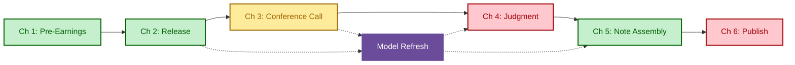
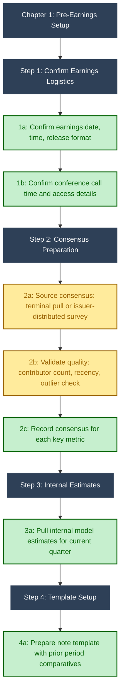
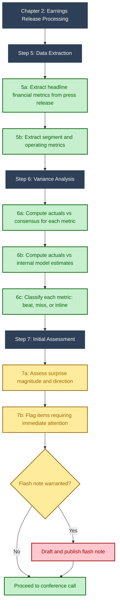
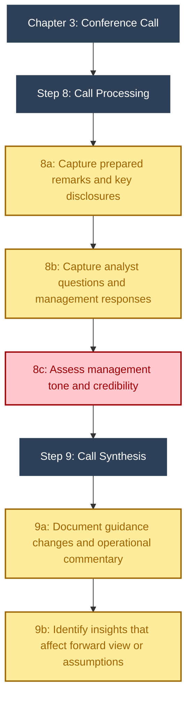
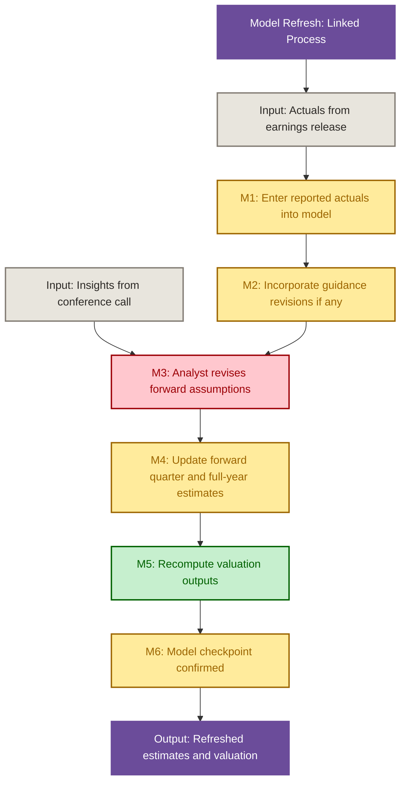
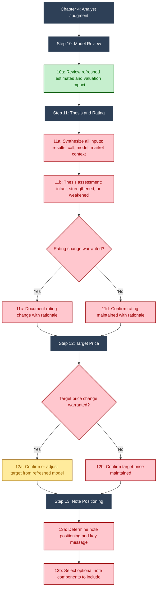
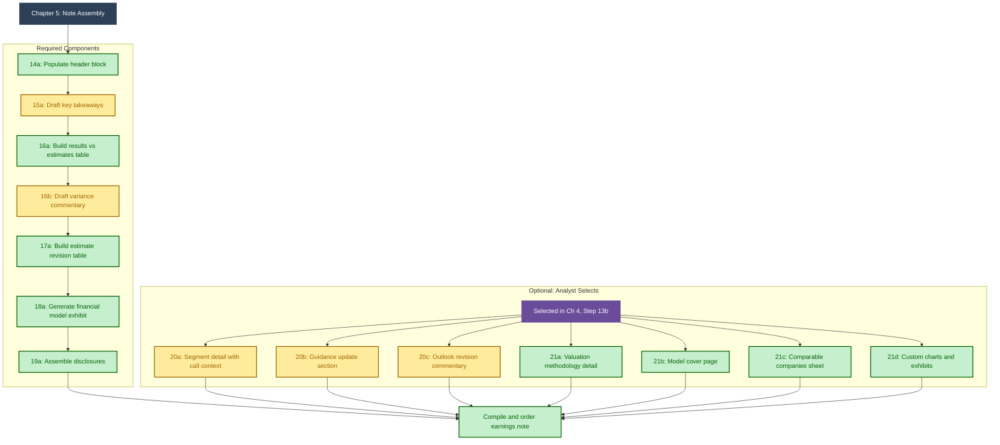
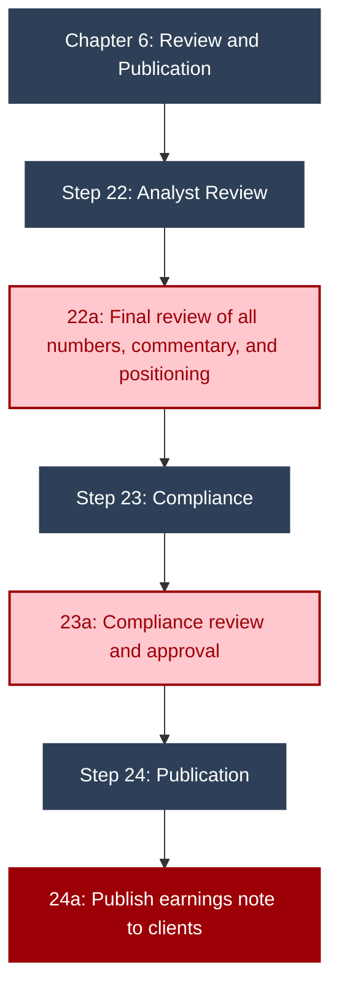

# Equity Research Earnings Note: Production Workflow

### LLM Capability Classification -- v3.0

> **53 sub-steps** . **6 chapters** . **1 linked process** . **3 decision points**
> Sector agnostic: energy, SaaS, financials, biotech, industrials, retail.
> Every step classified by what an LLM can and cannot do.
> v3.0 adds: linked Model Refresh, required vs optional note components, analyst-driven component selection, parallel execution model.

---

## LLM Capability Legend

| Color | Meaning | Description |
|:---:|---|---|
| Green | **LLM Can Do** | LLM can execute independently given prior context and data from earlier steps |
| Yellow | **LLM Needs Human** | LLM can draft or compute but needs human to supply data, validate, or approve output |
| Red | **Human Only** | Requires analyst judgment, proprietary access, compliance authority, or relationship context |

## Structural Legend

| Element | Meaning |
|---|---|
| **Phase Header** (dark fill) | Step groupings within chapters |
| **Linked Process** (purple fill) | Separate process connected to the main workflow by trigger, feed, and output relationships |
| **Decision Diamond** | Analyst decision point that determines downstream branching |

---

## Overview: End-to-End Flow with Linked Model Refresh

Six chapters from pre-earnings preparation through publication. The Model Refresh runs as a linked process: triggered by the earnings release, fed by conference call insights, and outputs refreshed estimates to Judgment and Note Assembly. Solid lines are the main flow. Dotted lines are model refresh connections.

> **Model Refresh is a distinct process.** It is not part of the earnings note itself, but the note depends on it. The model refresh begins as soon as actuals are available (Ch 2), does not wait for the conference call, and its outputs (refreshed estimates, updated valuation) feed both the analyst's investment decisions (Ch 4) and the note's content (Ch 5). Dotted lines in the overview show these trigger, feed, and output relationships.

---

## Chapter 1: Pre-Earnings Setup

> *Before the earnings release. Estimates ready, consensus validated, template prepared.*
>
> 5 Green | 2 Yellow | 0 Red

**Consensus sources.** Consensus can come from two channels. The first is a terminal pull from Bloomberg BEst, FactSet, or Visible Alpha. The second is an issuer-distributed survey, where the company's IR team collects estimates from covering analysts and distributes a summarized result back to the street before earnings. Whichever source is used, Step 2b applies: validate quality before any beat/miss classification downstream. A beat against stale consensus with 3 contributors is a fundamentally different signal than a beat against fresh consensus with 15.

---

## Chapter 2: Earnings Release Processing

> *Company publishes results. Extract, compare, classify. Optional flash note. Model Refresh triggered here.*
>
> 5 Green | 2 Yellow | 1 Red

**Flash notes are optional.** Not all firms issue them. When issued, they are 1-2 paragraphs: headline result, beat/miss classification, initial read. No updated estimates or valuation. The decision to issue is yellow (analyst judgment on materiality); the compliance review and publication are red.

**Model Refresh triggers here.** As soon as actuals are extracted (Steps 5a-5b), the associate can begin entering them into the model. The model refresh runs alongside the conference call, not after it. See the Model Refresh section below.

---

## Chapter 3: Conference Call

> *Analyst-focused. Listen, capture, assess. No model work here. Call insights feed the Model Refresh.*
>
> 0 Green | 4 Yellow | 1 Red

**Management tone is red.** Transcription and factual extraction are automatable. Assessing whether management sounded defensive, whether confidence seemed genuine, or whether the question-and-answer session revealed gaps requires relationship context and multi-quarter pattern recognition.

**Call insights feed the Model Refresh.** After the call, the analyst communicates guidance changes, operational color, and any items that affect forward assumptions to the associate working on the model. This is the FEED connection shown in the overview. Step 9b is specifically about identifying what needs to flow into assumption revisions.

---

## Model Refresh (Linked Process)

> *Distinct process that runs alongside the earnings note workflow. Triggered by actuals availability (Ch 2), fed by conference call insights (Ch 3). Outputs refreshed estimates and valuation to Judgment (Ch 4) and Note Assembly (Ch 5).*
>
> 1 Green | 4 Yellow | 1 Red

**M3 is the analyst's independent judgment.** This is where the analyst's view of the business manifests. Forward assumption revisions can be driven by guidance changes, results quality, management credibility, competitive dynamics, macro shifts, or the analyst's own evolving sector thesis. Guidance change is one input among many. An analyst can revise their outlook materially even when guidance is unchanged, based on what they saw in the results or heard on the call.

**Timing.** M1 and M2 begin as soon as actuals are extracted in Ch 2, running concurrently with the conference call. M3 requires both the initial model population (M2) and call insights (Ch 3, Step 9b). M4 through M6 follow sequentially. The model checkpoint at M6 confirms the refreshed model is ready for Ch 4 and Ch 5 to consume.

---

## Chapter 4: Analyst Judgment

> *Synthesize all inputs. Thesis, rating, target, positioning, and note component selection. The analyst's decisions here shape the entire note.*
>
> 1 Green | 1 Yellow | 7 Red

**Judgment is driven by the totality of inputs, not only guidance.** Step 11a synthesizes results quality, management credibility, competitive positioning shifts, the refreshed model, and the analyst's own evolving sector view. An analyst covering an integrated oil company might change their thesis based on upstream operational underperformance even if downstream results and guidance are strong. The judgment is holistic.

**Step 13b shapes the note.** Different analysts covering the same company may produce structurally different notes based on what they consider material. One analyst may include a detailed comps sheet because peer dynamics shifted. Another may skip comps entirely and add an outlook revision commentary because the estimate change is the story. The analyst's decisions and style dictate what the note contains.

**The N12a/N12b asymmetry.** Step 12a (target change) is yellow because the mechanical recalculation from refreshed model outputs is LLM-assistable -- the analyst adjusts the target based on updated valuation math. Step 12b (target maintained) is red because the decision to hold a target unchanged despite new information is itself an analytical judgment: the analyst is asserting that the update does not warrant a revision, which requires weighing materiality, conviction, and positioning.

---

## Chapter 5: Note Assembly

> *Required components form the spine of every note. Optional components are selected by the analyst in Ch 4, Step 13b. All converge to final compilation.*
>
> 10 Green | 5 Yellow | 0 Red (includes 7 optional)

**Required components appear in every earnings note.** Header block (ticker, rating, target, price, market cap, analyst, date). Key takeaways (2-4 sentences). Results vs estimates table. Variance commentary. Estimate revision table (old vs new). Financial model exhibit (multi-year income statement and key metrics). Disclosures (analyst certification, ownership, banking relationships, rating distribution per FINRA/IIROC).

**Optional components are not lesser components.** An outlook revision commentary may be the most important section in the note if the analyst materially changed estimates. A comps sheet matters when peer dynamics are the story. A model cover page helps institutional clients who model alongside the analyst. The "optional" label means the analyst decides whether they add value for this specific quarter, not that they are secondary in importance.

---

## Chapter 6: Review and Publication

> *Final review, compliance clearance, and distribution. Entirely human-owned.*
>
> 0 Green | 0 Yellow | 3 Red

**Compliance requirements.** Research publications are regulated by FINRA (US) and IIROC (Canada). The compliance review confirms analyst certification language, required disclosures (ownership, banking relationships, rating distribution), and that the note does not contain forward-looking statements without appropriate disclaimers. This step cannot be automated or delegated.

---

## Capability Summary

| Section | Green | Yellow | Red | Total |
|---|:---:|:---:|:---:|:---:|
| Ch 1: Pre-Earnings Setup | 5 | 2 | 0 | 7 |
| Ch 2: Earnings Release | 5 | 2 | 1 | 8 |
| Ch 3: Conference Call | 0 | 4 | 1 | 5 |
| Model Refresh (Linked) | 1 | 4 | 1 | 6 |
| Ch 4: Analyst Judgment | 1 | 1 | 7 | 9 |
| Ch 5: Note Assembly (Req.) | 6 | 2 | 0 | 8 |
| Ch 5: Note Assembly (Opt.) | 4 | 3 | 0 | 7 |
| Ch 6: Review and Publication | 0 | 0 | 3 | 3 |
| **Total** | **22** | **18** | **13** | **53** |

---

## Architecture: What Changed in v3.0

| Change | Rationale |
|---|---|
| Model Refresh is a linked process, not embedded in Ch 3 | The model is not part of the earnings note. It is a separate deliverable that the note consumes. Separating it reflects how the work actually runs: the associate begins entering actuals before the call starts. |
| Conference Call (Ch 3) is analyst-focused, no model work | The analyst's job during the call is to listen, capture, and assess. Model population happens concurrently on the associate track. Mixing them in one chart obscured the parallel execution. |
| Analyst judgment (Ch 4) broadened beyond guidance | Analysts change their view based on the totality of inputs: results quality, management credibility, competitive dynamics, macro context, and their own evolving thesis. Guidance change is one trigger among many. The prior version over-indexed on guidance as the sole decision driver. |
| Step 13b: Analyst selects optional note components | The analyst's style and emphasis dictate what appears in the note. Some quarters call for a detailed comps sheet. Others need outlook revision commentary. The decision about what to include is itself an analytical judgment. |
| Note Assembly (Ch 5) splits required from optional | Required components appear in every note and form the spine. Optional components are bolt-ons selected based on what is material. This distinction prevents both over-production (generating components no one reads) and under-production (missing the section that tells the story). |

---

## Sector Customization Points

| Dimension | Examples |
|---|---|
| **Headline Metrics** | Energy: production, CFFO, AFFO/sh. SaaS: ARR, NRR, operating margin. Banks: NIM, EPS, NCO. Retail: comps, margin. Biotech: pipeline, cash runway. |
| **Segment Structure** | Integrated oil: upstream/downstream. Conglomerates: business units. Banks: commercial/consumer/wealth. Retailers: geography/channel. |
| **Guidance Format** | Point vs ranges, annual vs quarterly, quantitative vs qualitative. Some sectors rarely provide formal guidance. |
| **Valuation Method** | DCF (stable cash flows), EV/EBITDA (industrials), P/E (financials), NAV (REITs/resources), rNPV (biotech), SOTP (conglomerates). |
| **Model Refresh Depth** | Single-segment companies: quick refresh. Integrated/multi-segment: each segment updated independently, consolidation checked. |
| **Optional Components** | Energy analysts often include comps sheets and model cover pages. SaaS analysts may emphasize cohort analysis. Biotech may include pipeline probability tables. |

---

## Earnings Note Standard Sections vs. Top-Tier Brokers

| # | Section | Broker Equivalents |
|---|---|---|
| 1 | Header Block | Ticker, rating, target, share price, market cap, analyst, date. All brokers. |
| 2 | Key Takeaways | Goldman: "What happened." RBC: "Investment summary." TD/BMO: "Highlights." |
| 3 | Results vs Estimates | Actuals vs consensus vs internal, beat/miss per line. All brokers. |
| 4 | Segment Detail (opt.) | Operating review by segment with call color. Depth varies by analyst. |
| 5 | Guidance Update (opt.) | New vs prior, attainability assessment. Only when guidance changed. |
| 6 | Estimate Changes | Old vs new for key metrics. Bridge for material changes. All brokers. |
| 7 | Outlook Commentary (opt.) | Forward view rationale. JPM: "Outlook." Goldman: "Our view." Analyst-driven. |
| 8 | Valuation (opt.) | Target price methodology and basis. Included when target changes. |
| 9 | Financial Model Exhibit | Multi-year income statement, per-share metrics, margins, multiples. All brokers. |
| 10 | Disclosures | Analyst certification, ownership, banking relationships, rating distribution. |

---

## Usage

**GitHub** -- Push this README.md for native Mermaid rendering with capability colors.

**Interactive** -- Paste individual charts at [mermaid.live](https://mermaid.live) or use the raw .mermaid file.

**Presentation** -- Open er_earnings_note_v3_0.html for the light-mode presentation version with copy buttons.

---

*Equity Research Earnings Note Production Workflow v3.0 | Sector Agnostic | Linked Model Refresh | Required and Optional Components*
